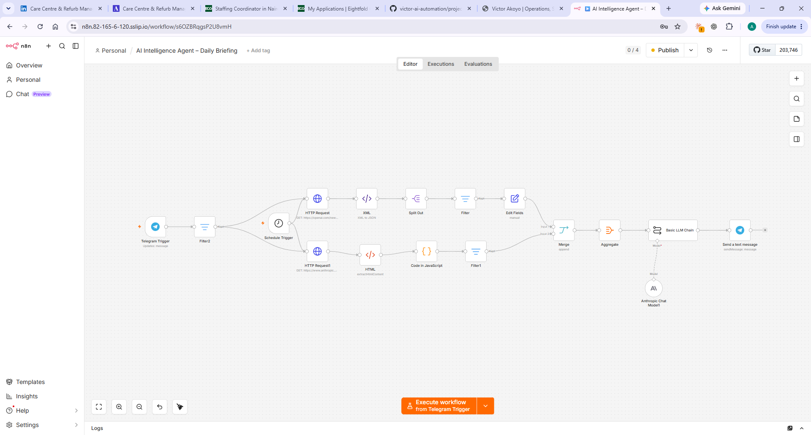
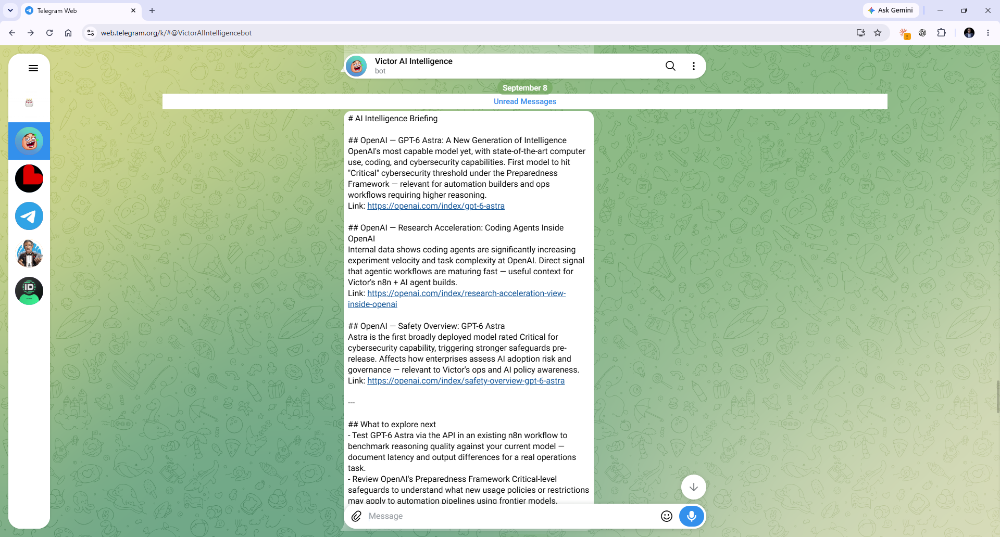

# Daily AI Briefing

**Platform:** n8n  
**Status:** Working project / continuing development  
**Project Type:** Workflow Automation • AI-Assisted Information Processing • Operational Reporting

---

## Overview

Daily AI Briefing is an n8n workflow designed to reduce the repetitive work involved in monitoring developments across AI tools and platforms.

The workflow collects information from selected web and RSS sources, processes and filters the incoming content, aggregates relevant items, uses an LLM to produce a concise briefing, and delivers the resulting summary through Telegram.

The project is part of my ongoing development in workflow automation, APIs, structured data and AI-enabled operational processes.

---

## Business Problem

Keeping up with developments across AI platforms and tools can require repeatedly checking multiple information sources, identifying relevant updates and manually summarising them.

The underlying operational problem is broader than AI news:

> How can repetitive information gathering be converted into a structured workflow that produces a useful output for human review?

The Daily AI Briefing explores one practical solution.

---

## Workflow

```text
Scheduled Trigger
       ↓
RSS / Web Sources
       ↓
Content Retrieval
       ↓
Filtering & Processing
       ↓
Aggregation
       ↓
LLM Summarisation
       ↓
Telegram Briefing
```

### Workflow Implementation

The screenshot below shows the current n8n implementation of the Daily AI Briefing workflow.



The implementation combines scheduled and Telegram-triggered execution with web/RSS content retrieval, filtering and transformation, aggregation, LLM-assisted summarisation and Telegram delivery.

The workflow separates information collection, processing, AI analysis and delivery into distinct stages rather than treating the task as one large AI prompt.

---

## How It Works

### 1. Scheduled Trigger

The workflow starts automatically according to a defined schedule.

This removes the need to manually initiate the information-gathering process.

### 2. Information Collection

Selected RSS feeds and web sources provide the incoming information.

The workflow retrieves content from these sources so that it can be processed further.

### 3. Content Processing

Incoming items are separated, cleaned and processed so that individual pieces of information can be evaluated.

Filtering helps remove irrelevant material before later stages of the workflow.

### 4. Aggregation

Relevant information is brought together into a structured collection before being passed to the language model.

This creates a more controlled input for the summarisation stage.

### 5. AI-Assisted Summarisation

An OpenAI language model transforms the processed information into a shorter, structured briefing.

The LLM performs a specific processing task within the wider workflow rather than acting as the entire automation.

### 6. Telegram Delivery

The completed briefing is automatically delivered through Telegram, creating a simple interface for receiving and reviewing the output.

---

## Example Output

The workflow produces a concise briefing that is delivered directly to Telegram for human review.



The output represents the final stage of the workflow:

```text
Source Information
        ↓
Filtering & Processing
        ↓
AI-Assisted Summarisation
        ↓
Human-Readable Briefing
        ↓
Telegram
```

---

## Workflow Components

The project has involved working with n8n components including:

- Schedule Trigger
- HTTP requests
- RSS/XML data
- XML processing
- Split operations
- Filters
- Edit/Set operations
- HTML extraction
- Code nodes
- Merge operations
- Aggregation
- Basic LLM Chain
- OpenAI Chat Model
- Telegram

Each component performs a specific part of the overall process rather than placing all workflow logic inside a single step.

---

## Inputs, Processing and Outputs

### Inputs

Information retrieved from selected RSS feeds and web sources.

Typical incoming information includes items such as:

- article or update title;
- source;
- publication information;
- link;
- retrieved page or feed content.

### Processing

The workflow:

1. retrieves source content;
2. converts incoming information into processable items;
3. filters and cleans relevant content;
4. combines selected information;
5. prepares structured content for the LLM;
6. generates a concise briefing;
7. delivers the completed output through Telegram.

### Output

A human-readable, AI-assisted briefing containing selected developments from the monitored information sources.

---

## What This Project Demonstrates

This project provides practical experience with several transferable automation concepts.

### Workflow Decomposition

Breaking a larger business process into smaller stages with clearly defined responsibilities.

### Triggers

Using an event or schedule to initiate a workflow automatically.

### Data Retrieval

Collecting information from external sources so that it can enter an automated process.

### Data Transformation

Changing information from one structure or format into another so downstream steps can use it.

### Filtering

Applying rules to determine which information should continue through the workflow.

### Aggregation

Combining multiple pieces of information into a structured input for later processing.

### API-Based Services

Connecting different applications and services so that information can move between systems.

### LLM Integration

Using a language model for a defined processing task within a larger automated workflow.

### Automated Delivery

Sending the final output automatically to the channel where it will be consumed.

---

## Operational Relevance

Although this project uses AI-industry information as its subject, the underlying workflow pattern can be applied to many operational problems.

```text
Multiple Information Sources
          ↓
Retrieve Data
          ↓
Apply Rules
          ↓
Consolidate
          ↓
Analyse / Summarise
          ↓
Deliver to Decision Maker
```

Similar patterns could support:

- operational KPI summaries;
- supplier and logistics updates;
- customer issue monitoring;
- management reporting;
- exception reporting;
- daily operational briefings;
- market or competitor monitoring;
- recurring administrative processes.

The transferable capability is therefore not simply generating an AI-news summary.

The broader concept is designing a structured process that moves information from multiple sources through defined processing stages and produces a useful output for a decision maker.

---

## Development Focus

This project is also being used to deepen my practical understanding of the technical concepts underneath workflow automation.

Current development areas include:

- n8n workflow design;
- JSON and structured data;
- HTTP and REST APIs;
- webhooks;
- authentication and OAuth;
- error handling;
- workflow monitoring;
- Git and GitHub;
- AI tool orchestration.

The objective is progressive independence: understanding not only how to make a workflow operate, but why each component is required, what data moves between stages and how the same concepts transfer to other operational problems.

---

## Development Status

The core workflow has been built and tested as a working project.

Current functionality includes:

- automated workflow initiation;
- retrieval from selected information sources;
- filtering and transformation;
- aggregation of relevant content;
- LLM-assisted summarisation;
- Telegram delivery.

Further development may include:

- improved source management;
- stronger filtering and relevance rules;
- duplicate-content handling;
- stronger error handling;
- retry logic;
- structured logging;
- improved prompt and output consistency;
- additional testing and monitoring;
- sanitised workflow export for portfolio review.

---

## Portfolio Evidence

This project currently includes:

- project documentation;
- workflow architecture description;
- n8n implementation screenshot;
- workflow component breakdown;
- input-processing-output explanation;
- Telegram output evidence.

Additional evidence may be added progressively, including:

- sanitised workflow export files;
- representative sample data;
- architecture diagrams;
- implementation notes;
- error-handling examples;
- troubleshooting lessons;
- testing documentation.

Sensitive credentials, API keys, tokens, webhook details and private configuration will not be published.

---

## Key Learning

The most important lesson from this project is that useful automation is not simply about connecting applications.

A reliable workflow requires understanding:

> **What triggers the process → what data enters → how the data is transformed → what decisions are applied → what output is required → where that output should go.**

The LLM is only one component inside that wider process.

This process-thinking approach is directly transferable to operational automation beyond n8n and beyond AI-news monitoring.

---

[← Back to Automation Portfolio](../../README.md)

[Professional Portfolio](https://vicakoyo.github.io/)
