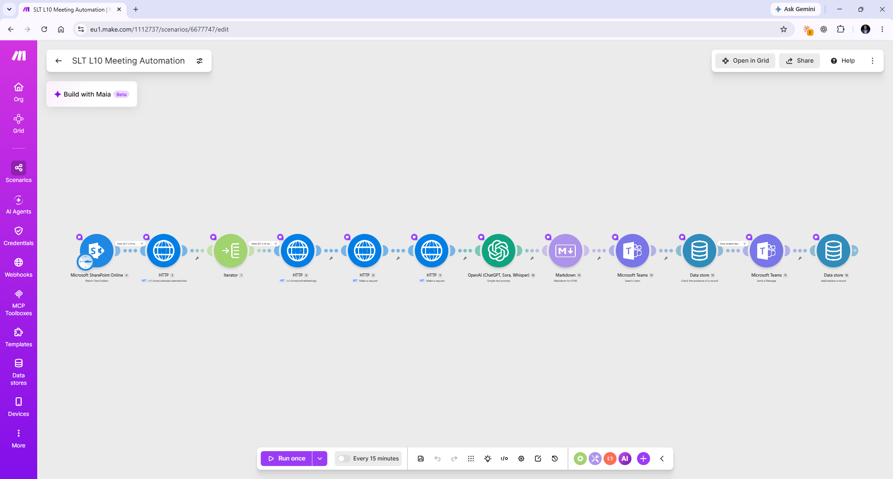

# Executive Meeting Intelligence

**Platform:** Make.com • Microsoft SharePoint • Microsoft Graph • OpenAI • Microsoft Teams • Make Data Store  
**Status:** Workplace implementation / portfolio documentation in progress  
**Project Type:** Workflow Automation • AI-Assisted Management Reporting • Microsoft 365 Integration

---

## Overview

Executive Meeting Intelligence is a workplace automation designed to reduce the manual effort involved in turning senior leadership meeting information into structured management reporting.

The workflow uses Make.com to connect Microsoft SharePoint, Microsoft Graph, OpenAI, Microsoft Teams and persistent workflow records.

When relevant meeting information becomes available, the automation retrieves the associated data, processes the meeting content, uses an LLM to generate a structured report, prepares the output for delivery and sends the result through Microsoft Teams.

The project demonstrates how AI can be incorporated into a wider operational workflow rather than used as a standalone tool.

---

## Business Problem

Leadership meetings generate valuable information, but converting meeting content into a useful management report can require significant manual work.

The process may involve:

- locating the relevant meeting information;
- retrieving the transcript or meeting content;
- reviewing lengthy material;
- extracting the most useful information;
- structuring the output consistently;
- distributing the result;
- avoiding repeated processing of the same meeting.

The underlying operational question is:

> How can meeting information move automatically from a collaboration system through structured processing and AI-assisted analysis to a useful management output?

This workflow was developed as one practical solution.

---

## Workflow

```text
SharePoint
    ↓
Microsoft Graph / HTTP
    ↓
Meeting Records
    ↓
Iterator
    ↓
Meeting & Transcript Retrieval
    ↓
OpenAI Analysis
    ↓
Markdown / Output Formatting
    ↓
Microsoft Teams
    ↓
Data Store Check
    ↓
Delivery Control
    ↓
Microsoft Teams Delivery
    ↓
Data Store Update
```

### Workflow Implementation

The screenshot below shows the Make.com implementation of the meeting intelligence workflow.



The implementation combines SharePoint monitoring, Microsoft Graph API requests, record iteration, transcript or meeting-data retrieval, AI-assisted processing, output formatting, Teams integration and persistent workflow state.

This structure separates information retrieval, processing, AI analysis, delivery and execution control into distinct stages.

---

## How It Works

### 1. SharePoint Monitoring

Microsoft SharePoint Online acts as an entry point into the workflow.

The Make.com scenario monitors the relevant SharePoint location for changes associated with the meeting process.

This allows the workflow to begin automatically rather than requiring someone to manually start the reporting process.

### 2. Microsoft Graph Retrieval

HTTP requests are used to interact with Microsoft Graph.

Microsoft Graph provides an API layer through which Microsoft 365 information can be retrieved programmatically.

In this workflow, Graph requests support retrieval of meeting-related information needed for later stages of the automation.

### 3. Record Iteration

The Iterator separates a collection of returned records into individual items.

Instead of attempting to process several records as one large object, Make.com can work through them individually.

This is a transferable automation concept:

```text
Collection of records
        ↓
Iterator
        ↓
Record 1
Record 2
Record 3
...
```

### 4. Meeting and Transcript Retrieval

Additional HTTP requests retrieve the information required to identify and process the relevant meeting.

This stage connects the initial trigger information with the meeting content that will ultimately be analysed.

The exact Microsoft 365 resources are accessed through API requests rather than relying entirely on manual navigation through Teams or SharePoint.

### 5. AI-Assisted Analysis

The retrieved meeting content is passed to OpenAI using a predefined analysis prompt.

The LLM transforms the raw meeting information into a more concise and structured management output.

The AI model performs one defined processing function inside a larger workflow.

It does not control the entire automation.

### 6. Output Formatting

A Markdown processing step prepares the generated content for downstream delivery.

This separates the generation of the management content from the way that content needs to be presented in the destination system.

### 7. Microsoft Teams Integration

The workflow uses Microsoft Teams modules as part of the delivery process.

The automation can identify the appropriate Teams destination information and prepare the generated report for delivery.

### 8. Data Store Check

A Make.com Data Store is used to retain workflow state.

Before the final delivery stage, the automation checks whether a relevant record already exists.

This allows a later workflow execution to make a decision using information preserved from an earlier execution.

This concept is known as **persistence** or **state**.

### 9. Delivery Control

A filter between the state check and the Teams delivery stage controls which records are allowed to continue.

This helps prevent already-handled items from being processed or delivered unnecessarily.

The pattern is:

```text
Check previous state
        ↓
Has this already been handled?
       / \
     Yes  No
      ↓    ↓
    Stop  Continue
```

### 10. Teams Delivery

The structured management output is sent through Microsoft Teams.

This places the result directly inside the collaboration environment where the information can be reviewed and used.

### 11. State Update

After the delivery stage, the workflow updates the Data Store.

This records that the relevant item has been handled and provides information that future executions can use.

---

## Workflow Components

The implementation includes components such as:

- Microsoft SharePoint Online
- HTTP requests
- Microsoft Graph
- Iterator
- OpenAI
- Markdown processing
- Microsoft Teams
- Make Data Store
- Filters
- persistent workflow records

Each component performs a different responsibility within the overall process.

---

## Inputs, Processing and Outputs

### Inputs

The workflow works with information associated with leadership meetings, including meeting-related records and transcript content retrieved through the Microsoft 365 environment.

### Processing

At a high level, the workflow:

1. detects relevant activity through SharePoint;
2. retrieves Microsoft 365 meeting information through API requests;
3. separates returned records where necessary;
4. retrieves the relevant meeting or transcript information;
5. prepares the content for AI processing;
6. sends the content to an OpenAI language model;
7. converts the resulting output into a suitable format;
8. checks existing workflow state;
9. applies delivery-control logic;
10. sends the structured result through Microsoft Teams;
11. records the completed processing state.

### Outputs

The primary output is a structured AI-assisted management report delivered through Microsoft Teams.

The workflow also produces a persistent processing record that can be used by later executions to determine whether an item has already been handled.

---

## What This Project Demonstrates

This project provides practical experience with several transferable automation concepts.

### Event-Driven Workflow Design

Using activity in one business system to initiate a wider automated process.

### Microsoft 365 Integration

Connecting SharePoint, Microsoft Graph and Microsoft Teams within a single operational workflow.

### API Requests

Using HTTP requests to retrieve information programmatically rather than relying on manual interaction with an application.

### Iteration

Taking a collection of returned data and processing individual records separately.

### Data Transformation

Preparing information so that each downstream system receives data in a form it can use.

### LLM Integration

Using a language model for a defined analysis task within a wider business process.

### Output Formatting

Separating content generation from the formatting required by the destination application.

### Conditional Logic

Using filters and previous workflow information to determine whether processing should continue.

### Persistence and State

Recording information from one execution so that future executions can make better decisions.

### Automated Delivery

Placing the completed output directly into the collaboration environment where it will be consumed.

---

## Why the Data Store Matters

One of the important concepts in this project is that an automation sometimes needs to remember what happened previously.

Without stored state, a workflow may process the same item repeatedly each time it runs.

A Data Store provides a simple form of workflow memory.

For example:

```text
Meeting A processed
        ↓
Store record: Meeting A = handled
        ↓
Workflow runs again
        ↓
Check Data Store
        ↓
Meeting A already handled
        ↓
Do not deliver again
```

This is different from the AI model remembering information.

The persistence is handled by the workflow architecture itself.

---

## Operational Relevance

Although this project was designed around leadership meeting reporting, the architecture is applicable to many recurring information-processing workflows.

For example:

```text
Business Event
      ↓
Retrieve Information
      ↓
Process Records
      ↓
Analyse Content
      ↓
Format Result
      ↓
Check Previous State
      ↓
Apply Rules
      ↓
Deliver Output
      ↓
Record Completion
```

Similar patterns could support:

- management meeting reporting;
- operational review summaries;
- customer review reporting;
- recurring KPI commentary;
- incident or issue summaries;
- supplier review reporting;
- audit or quality-meeting documentation;
- recurring administrative reporting.

The transferable capability is therefore not limited to meeting transcription.

The wider concept is designing an end-to-end information workflow with clear triggers, retrieval, processing, analysis, delivery and control stages.

---

## Human Review and AI

The objective of the workflow is not to remove human judgement from management reporting.

The automation reduces repetitive information-processing work and produces a structured output that can then be reviewed by the people responsible for the meeting and its resulting decisions.

This creates a practical division of work:

```text
Automation
    ↓
Retrieve + organise + summarise
    ↓
Human
    ↓
Review + interpret + decide + act
```

The LLM supports the information-processing stage while operational judgement remains with the users of the report.

---

## Confidentiality and Public Evidence

This project is based on a real workplace implementation.

The original workflow processed internal leadership information, so confidential source material will not be published in this repository.

The public portfolio will not include:

- original leadership meeting transcripts;
- confidential management reports;
- internal financial information;
- customer information;
- employee information;
- private SharePoint content;
- credentials or authentication information;
- API keys or tokens.

Where example inputs or outputs are added, they will use anonymised or recreated information that demonstrates the workflow without disclosing company-confidential content.

---

## Development Focus

This project has supported practical development in:

- Make.com workflow design;
- Microsoft 365 integration;
- Microsoft Graph;
- HTTP requests;
- API-based information retrieval;
- record iteration;
- LLM integration;
- Markdown and output formatting;
- conditional workflow logic;
- persistent data;
- workflow state;
- automated Microsoft Teams delivery.

The project also reinforces the importance of understanding what information enters each stage, how it is transformed and what the downstream system expects.

---

## Development Status

The core workflow was implemented for a real workplace reporting process.

Current documented functionality includes:

- SharePoint monitoring;
- Microsoft Graph / HTTP integration;
- record iteration;
- meeting-information retrieval;
- AI-assisted analysis;
- output formatting;
- Microsoft Teams integration;
- Data Store checks;
- conditional delivery control;
- persistent completion records.

Further portfolio development may include:

- a recreated sample meeting input;
- an anonymised example management report;
- a simplified architecture diagram;
- more detailed API data-flow documentation;
- error-handling documentation;
- representative testing scenarios;
- implementation lessons.

---

## Portfolio Evidence

This project currently includes:

- project documentation;
- high-level workflow architecture;
- Make.com implementation screenshot;
- workflow-component explanation;
- input-processing-output documentation;
- persistence and delivery-control explanation.

Additional evidence may be added progressively using recreated or sanitised material.

Sensitive workplace information and credentials will remain excluded.

---

## Key Learning

The most important lesson from this project is that AI-enabled automation is still fundamentally a process-design problem.

The complete system requires understanding:

> **What starts the process → where the information comes from → how records are retrieved → how data is separated and transformed → where AI adds value → how output is formatted → what has already been processed → where the result should be delivered → how completion is recorded.**

The OpenAI step is important, but it is only one part of the overall architecture.

The larger capability is designing an operational information flow that connects business systems, processing logic, AI and human decision-making.

---

[← Back to Automation Portfolio](../../README.md)

[Professional Portfolio](https://vicakoyo.github.io/)
