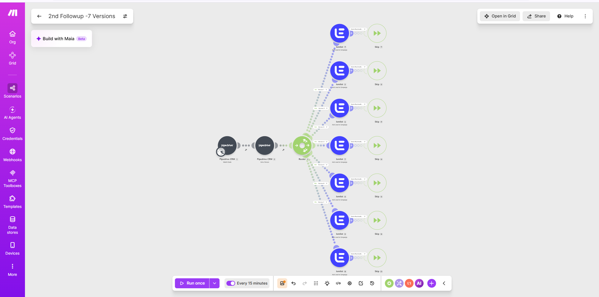

# CRM Campaign Routing Automation

**Platform:** Make.com • Pipedrive • Lemlist  
**Status:** Workplace implementation / portfolio documentation in progress  
**Project Type:** Workflow Automation • CRM Integration • Conditional Routing • Sales & Marketing Operations

---

## Overview

CRM Campaign Routing Automation is a workplace workflow designed to reduce repetitive manual work between a CRM and an outbound campaign platform.

The workflow monitors activity in Pipedrive, retrieves the person associated with the relevant deal, evaluates the information using defined routing rules and sends the contact into the appropriate Lemlist campaign.

The current implementation uses multiple conditional branches so that different records can follow different campaign paths rather than being handled through one generic process.

The project demonstrates how business rules can be converted into automated routing logic across connected systems.

---

## Business Problem

Managing follow-up activity across CRM and outreach platforms can involve repetitive administrative work.

Without automation, someone may need to:

- monitor changing deal records;
- identify the associated contact;
- review CRM information;
- decide which follow-up route applies;
- locate the correct outreach campaign;
- add the contact manually;
- repeat the same decision process for many records.

This creates opportunities for inconsistent routing, missed follow-up and unnecessary administrative work.

The underlying operational question is:

> How can CRM information automatically trigger the correct downstream action based on predefined business rules?

This workflow was implemented as one practical solution.

---

## Workflow

```text
Pipedrive Deal Activity
        ↓
Watch Deals
        ↓
Retrieve Associated Person
        ↓
Router
        ↓
Evaluate Routing Conditions
        ↓
 ┌──────┼──────┬──────┬──────┬──────┬──────┐
 ↓      ↓      ↓      ↓      ↓      ↓      ↓
Route 1 Route 2 Route 3 Route 4 Route 5 Route 6 Route 7
 ↓      ↓      ↓      ↓      ↓      ↓      ↓
Lemlist Campaign Assignment
        ↓
Branch Completion / Skip Handling
```

### Workflow Implementation

The screenshot below shows the Make.com implementation of the CRM campaign-routing workflow.



The implementation begins with Pipedrive, retrieves the relevant contact information and then uses a Make.com Router to divide records across multiple conditional paths.

The current workflow contains seven routing branches, with each eligible branch connected to a Lemlist campaign action.

This means that the workflow does not treat every CRM record in the same way. The route taken depends on the conditions defined for that branch.

---

## How It Works

### 1. Pipedrive Deal Monitoring

The workflow begins with a Pipedrive module that watches deal activity.

This provides the event that starts the automation.

Instead of someone repeatedly checking the CRM for records that require follow-up, the workflow can respond automatically when relevant deal information becomes available.

---

### 2. Person Retrieval

A second Pipedrive module retrieves the person associated with the deal.

This is important because a CRM deal and a CRM contact are related but distinct records.

The deal may contain information about the sales opportunity, while the associated person record contains the contact information required for the outreach action.

The workflow therefore performs a relationship lookup:

```text
Deal
  ↓
Associated Person ID
  ↓
Person Record
  ↓
Contact Information
```

---

### 3. Router

The retrieved information enters a Make.com Router.

A Router allows one workflow to split into several possible paths.

The Router itself does not decide which route is correct. Each route contains conditions that determine whether the incoming record is allowed to continue through that branch.

Conceptually:

```text
Incoming Record
      ↓
    Router
   /  |  |  \
  A   B  C   D ...
```

---

### 4. Conditional Routing

Each branch applies its own routing conditions.

The workflow shown in the implementation contains seven versions or routes.

A record continues only through the route whose defined conditions are satisfied.

This converts a manual business decision into explicit workflow logic.

For example, the general pattern is:

```text
CRM Record
     ↓
Does Condition A apply?
     ↓
Yes → Campaign Route A

Does Condition B apply?
     ↓
Yes → Campaign Route B
```

The exact workplace routing criteria and campaign configuration are not published in this repository.

---

### 5. Lemlist Campaign Assignment

Eligible contacts are passed to Lemlist.

The relevant Lemlist module adds the lead to the campaign connected to that routing branch.

At this stage the workflow has converted CRM information into an automated campaign action.

The broader pattern is:

```text
CRM Event
    ↓
Business Rule
    ↓
Campaign Decision
    ↓
Outreach Platform
```

---

### 6. Branch Completion

The implementation also includes branch-handling steps after the Lemlist actions.

These help control how the individual routing paths terminate after the required campaign action has been taken.

This keeps each branch distinct and prevents unrelated downstream processing from being treated as part of the same route.

---

## Why the Router Matters

The Router is one of the most important concepts in this project.

Without conditional routing, the workflow would essentially say:

> Every record receives the same action.

With routing logic, the workflow instead says:

> Examine the information first, then choose the appropriate action.

That is the automation equivalent of an operational decision tree.

```text
New Record
    ↓
Check Rules
    ↓
 ┌───────────────┐
 │ Which case is │
 │ this record?  │
 └───────┬───────┘
         ↓
Different action depending on the answer
```

The same principle applies far beyond sales and marketing automation.

---

## Workflow Components

The implementation includes components such as:

- Pipedrive CRM
- Watch Deals
- Get a Person
- Make.com Router
- route filters
- conditional logic
- Lemlist
- Add Lead to Campaign
- multiple campaign branches
- branch completion / skip handling

Each component performs a specific responsibility within the wider process.

---

## Inputs, Processing and Outputs

### Inputs

The workflow starts with CRM information associated with a Pipedrive deal.

Relevant workflow data can include information connected to:

- the deal;
- the associated person;
- contact details;
- CRM fields used by routing logic;
- workflow execution information.

---

### Processing

At a high level, the workflow:

1. monitors Pipedrive deal activity;
2. identifies a deal requiring workflow processing;
3. retrieves the associated person record;
4. passes the resulting information to a Router;
5. evaluates the record against route-specific conditions;
6. selects the eligible route;
7. sends the lead into the corresponding Lemlist campaign;
8. completes the relevant branch.

---

### Output

The primary workflow output is the automatic placement of an eligible CRM contact into the appropriate Lemlist campaign.

The operational result is a handoff between CRM information and an outreach process without requiring the same routing decision to be performed manually each time.

---

## What This Project Demonstrates

This project provides practical experience with several transferable automation concepts.

### Trigger-Based Automation

Using activity in one business application to initiate another process automatically.

### Record Relationships

Retrieving information from a related CRM record rather than assuming all required information exists in the original record.

### Field Mapping

Moving information from one application's data structure into fields required by another application.

### Conditional Logic

Applying explicit rules to determine what happens to each incoming record.

### Routers

Allowing one workflow to support several possible downstream paths.

### Filters

Controlling whether a record is permitted to continue through a particular branch.

### Cross-Platform Integration

Connecting CRM and campaign-management systems so that actions in one system can influence another.

### Business-Rule Automation

Turning repeatable human decision criteria into workflow logic.

---

## Decision Logic as an Automation Concept

One of the broader lessons from this project is that automation does not always require AI.

Many operational decisions can be represented through deterministic rules.

A deterministic rule produces a predictable result when the same conditions are present.

For example:

```text
IF condition is true
THEN perform Action A

ELSE
evaluate another condition
```

In tools such as Make.com, this can be implemented through Routers and filters.

The same underlying concept appears elsewhere as:

- an IF node in n8n;
- a Condition action in Power Automate;
- an `if` statement in code;
- business rules inside an ERP or CRM;
- operational decision trees.

The interface changes, but the underlying logic remains the same.

---

## Operational Relevance

Although this workflow was used for CRM and outreach routing, the architecture is applicable to many operational processes.

The general pattern is:

```text
Business Event
      ↓
Retrieve Related Information
      ↓
Evaluate Conditions
      ↓
Select Route
      ↓
Perform Appropriate Action
```

Similar workflow patterns could support:

- customer service escalation;
- supplier issue routing;
- quality non-conformance handling;
- approval workflows;
- invoice categorisation;
- logistics exception management;
- recruitment workflows;
- service-ticket assignment;
- operational alerts;
- lead management.

The transferable capability is therefore not specific to Pipedrive or Lemlist.

It is the ability to convert repeatable operational decision rules into structured workflow logic.

---

## Why This Project Does Not Use an LLM

Unlike some of the other projects in this portfolio, this workflow does not require a language model to perform its core function.

The campaign decision is driven by defined routing logic rather than probabilistic AI analysis.

That distinction is important.

```text
Rule-Based Automation

Known input
    ↓
Defined condition
    ↓
Predictable action
```

versus:

```text
AI-Assisted Processing

Unstructured input
    ↓
Language model
    ↓
Generated / interpreted output
```

The appropriate approach depends on the business problem.

Using deterministic routing where clear rules already exist is often simpler, more predictable and easier to control than introducing AI unnecessarily.

---

## Confidentiality and Public Evidence

This project is based on a real workplace implementation.

The public portfolio will not expose:

- customer or prospect names;
- personal email addresses;
- CRM contact records;
- campaign recipient information;
- internal campaign names where sensitive;
- confidential routing criteria;
- account identifiers;
- credentials;
- API keys or tokens.

Screenshots and future examples will therefore be cropped, anonymised or recreated where necessary.

The purpose of the public documentation is to demonstrate the workflow architecture and underlying automation concepts without exposing business information.

---

## Development Focus

This project contributed practical experience in:

- Make.com;
- Pipedrive;
- Lemlist;
- trigger-based workflows;
- record relationships;
- field mapping;
- routers;
- filters;
- conditional logic;
- CRM-to-outreach integration;
- workflow testing.

It also reinforces the importance of understanding the business decision before attempting to automate it.

A workflow can only route records reliably when the underlying routing rule is clear.

---

## Development Status

The core workflow was implemented for a real workplace process.

Current documented functionality includes:

- monitoring Pipedrive deal activity;
- retrieving associated person information;
- conditional routing;
- seven workflow branches in the documented implementation;
- Lemlist campaign assignment;
- branch-specific processing.

Further portfolio development may include:

- recreated sample CRM records;
- anonymised examples of routing conditions;
- a simplified decision-tree diagram;
- field-mapping examples;
- representative testing scenarios;
- error-handling documentation;
- lessons from maintaining multiple routes.

---

## Portfolio Evidence

This project currently includes:

- project documentation;
- high-level workflow architecture;
- real Make.com implementation evidence;
- CRM relationship explanation;
- routing and filter explanation;
- input-processing-output documentation;
- operational-use examples.

Additional evidence may be added progressively using sanitised or recreated information.

Sensitive workplace data and credentials will remain excluded.

---

## Key Learning

The most important lesson from this project is that effective automation begins with clear decision logic.

The workflow can be reduced to a reusable pattern:

> **What event occurred → what related information is required → what conditions apply → which route should the record follow → what action should that route perform?**

The Make.com Router is simply the implementation of that business decision structure.

Understanding the decision logic underneath the tool is what makes the concept transferable to other automation platforms and operational processes.

---

[← Back to Automation Portfolio](../../README.md)

[Professional Portfolio](https://vicakoyo.github.io/)
