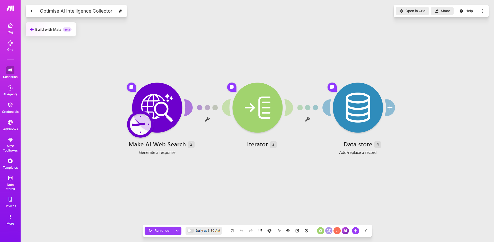
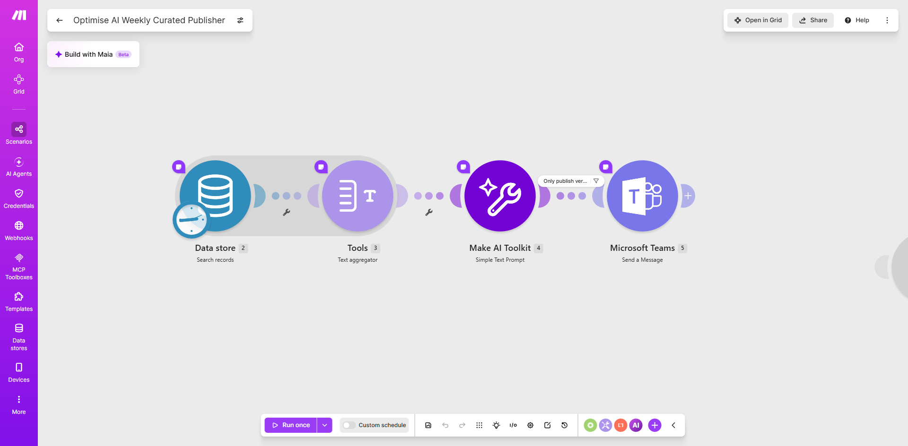

# Operational AI Intelligence System

**Platform:** Make.com • Make AI Web Search • Make AI Toolkit • Data Store • Microsoft Teams  
**Status:** Workplace implementation / portfolio documentation in progress  
**Project Type:** AI-Assisted Operational Intelligence • Workflow Automation • Continuous Improvement

---

## Overview

The Operational AI Intelligence System is a workplace automation designed to connect emerging AI capabilities with real operational problems identified across the business.

The system was developed around information and themes emerging from recurring departmental meetings, including blockers, repetitive work, process friction and areas where teams could potentially benefit from AI or automation.

Rather than simply circulating general AI news, the objective was to make AI discovery more relevant to the organisation's actual operating needs.

The implementation uses two related Make.com workflows:

1. **AI Intelligence Collector** — gathers relevant AI and technology intelligence, processes individual results and stores useful records for later use.
2. **AI Weekly Curated Publisher** — retrieves the accumulated intelligence, consolidates it, uses AI to prepare a curated weekly update and publishes the result through Microsoft Teams.

The result is a simple collection-to-publication pipeline for ongoing operational AI intelligence.

---

## Business Problem

AI tools and capabilities change quickly.

However, repeatedly sharing lists of new tools does not necessarily help an organisation improve.

A more useful approach is to start with questions such as:

> What problems are teams actually experiencing?

> Which blockers keep appearing?

> Where is repetitive administrative work occurring?

> Where could AI or workflow automation realistically improve the process?

Recurring departmental meetings already provide useful signals about operational challenges, priorities and friction.

The challenge is then connecting those internal problems with relevant external AI developments and turning the resulting information into something concise enough for regular review.

The Operational AI Intelligence System was designed to support that process.

---

## System Architecture

```text
Departmental Meetings
        ↓
Blockers / Problems / Repetitive Work
        ↓
Potential AI or Automation Opportunities
        ↓
AI Intelligence Collection
        ↓
External AI / Technology Research
        ↓
Structured Intelligence Records
        ↓
Data Store
        ↓
Weekly Retrieval
        ↓
Aggregation
        ↓
AI-Assisted Curation
        ↓
Microsoft Teams
        ↓
Weekly Operational AI Intelligence Update
```

The public portfolio separates the system into its two technical workflows: the **Collector** and the **Publisher**.

---

# 1. AI Intelligence Collector

The Collector is responsible for gathering and storing relevant AI intelligence.

Its purpose is to build a structured pool of information that can later be reviewed and curated rather than requiring the weekly publication workflow to discover everything from scratch.

## Collector Workflow

```text
Scheduled Execution
       ↓
Make AI Web Search
       ↓
Search / Research Response
       ↓
Iterator
       ↓
Individual Intelligence Items
       ↓
Data Store
       ↓
Stored Intelligence Records
```

## Collector Implementation

The screenshot below shows the Make.com implementation of the AI Intelligence Collector.



The visible implementation contains three major processing components:

```text
Make AI Web Search
        ↓
Iterator
        ↓
Data Store
```

The workflow is scheduled to run automatically.

---

## How the Collector Works

### AI Web Search

Make AI Web Search is used to retrieve relevant external information.

The aim is not simply to gather as much AI news as possible.

The broader operating context is to identify developments, capabilities and tools that may be relevant to issues or opportunities being observed inside the organisation.

This supports a problem-first approach:

```text
Operational Need
      ↓
Relevant Search
      ↓
Potential Technology / AI Insight
```

---

### Iterator

The search stage can return multiple pieces of information.

The Iterator separates those results so that individual items can be processed separately.

Conceptually:

```text
Search Results
     ↓
[Item A, Item B, Item C]
     ↓
Iterator
     ↓
Item A
Item B
Item C
```

This is a transferable automation concept.

A collection of records often needs to be separated before each item can be stored, evaluated or processed individually.

---

### Data Store

The resulting intelligence items are written into a Make.com Data Store.

This creates persistence between workflow executions.

Without persistent storage, information discovered during one run would disappear when that execution ended.

The Data Store therefore acts as the connection between the collection and publishing stages.

```text
Collector
   ↓
Data Store
   ↓
Publisher
```

This also means collection and publication do not have to happen at exactly the same time.

---

# 2. AI Weekly Curated Publisher

The Publisher is responsible for converting stored intelligence into a concise weekly output.

Rather than publishing individual search results directly, it retrieves the accumulated information, consolidates it and uses AI to prepare a more structured update.

## Publisher Workflow

```text
Scheduled Execution
       ↓
Data Store
       ↓
Search Stored Records
       ↓
Text Aggregator
       ↓
Combined Intelligence
       ↓
Make AI Toolkit
       ↓
AI-Assisted Curation
       ↓
Publishing Filter
       ↓
Microsoft Teams
       ↓
Weekly Intelligence Update
```

## Publisher Implementation

The screenshot below shows the Make.com implementation of the AI Weekly Curated Publisher.



The implementation contains four main stages:

```text
Data Store
    ↓
Text Aggregator
    ↓
Make AI Toolkit
    ↓
Microsoft Teams
```

A filter before the Teams stage provides an additional control over what continues to publication.

---

## How the Publisher Works

### Data Store Retrieval

The Publisher begins by searching the intelligence records stored by the collection process.

This separates **information gathering** from **information publishing**.

Instead of performing a completely new search every time a weekly report is required, the workflow can work from accumulated intelligence.

---

### Text Aggregation

Several individual records may exist in the Data Store.

The Text Aggregator combines those records into a consolidated input.

```text
Record 1
Record 2
Record 3
Record 4
    ↓
Text Aggregator
    ↓
Combined Intelligence
```

This creates a more useful input for the AI-processing stage.

---

### AI-Assisted Curation

The aggregated information is passed through the Make AI Toolkit.

The AI-processing stage helps convert a collection of separate intelligence records into a more concise and structured weekly output.

The objective is **curation**, not simply summarisation.

Useful curation can involve identifying:

- the most relevant developments;
- common themes;
- information connected to operational needs;
- opportunities worth investigating;
- tools or approaches that may merit further review.

The language model therefore supports the interpretation and communication stage of the workflow.

---

### Publishing Control

A filter is positioned before the Microsoft Teams delivery stage.

This provides a control point between generated content and publication.

The general concept is:

```text
Generated Output
       ↓
Publication Condition
      / \
    Pass  Fail
     ↓     ↓
Publish  Stop
```

This is useful because automated generation and automated publication do not always need to be treated as the same decision.

---

### Microsoft Teams Delivery

The final curated update is published through Microsoft Teams.

This places the information inside the collaboration environment already used by the organisation rather than requiring employees to visit another application.

The full information flow becomes:

```text
Research
   ↓
Store
   ↓
Retrieve
   ↓
Aggregate
   ↓
Curate
   ↓
Control
   ↓
Publish
```

---

## Why the System Uses Two Workflows

The separation between Collector and Publisher is an important architectural decision.

A single workflow could theoretically attempt to search, analyse and publish everything at once.

Instead, this system separates the responsibilities:

```text
COLLECTOR
Discover → Separate → Store

PUBLISHER
Retrieve → Aggregate → Curate → Publish
```

This provides several advantages.

Collection can happen independently from publication.

Multiple intelligence records can accumulate before the weekly review.

The publishing workflow can work from stored information rather than depending entirely on a fresh search at the moment of publication.

The architecture also makes each part easier to understand and modify independently.

---

## Inputs, Processing and Outputs

### Inputs

The wider operating process uses themes emerging from recurring departmental activity and meetings to help identify areas where AI or automation may be relevant.

The automated intelligence layer also retrieves external AI and technology information through the Make AI Web Search capability.

### Processing

At a high level, the system performs the following sequence:

```text
Identify Operational Themes
        ↓
Research Relevant AI Developments
        ↓
Separate Individual Results
        ↓
Store Intelligence
        ↓
Retrieve Stored Records
        ↓
Aggregate Records
        ↓
AI-Assisted Curation
        ↓
Apply Publishing Control
        ↓
Publish Weekly Update
```

### Outputs

The primary output is a curated operational AI intelligence update delivered through Microsoft Teams.

The intended result is to make emerging AI capabilities easier to evaluate in the context of actual business problems.

---

## What This Project Demonstrates

### Problem-First AI Adoption

Starting with business problems and operational friction rather than starting with a new AI tool.

### Scheduled Automation

Running recurring information processes automatically rather than relying on manual research.

### AI-Assisted Research

Using AI-enabled web search to retrieve information relevant to an operational intelligence process.

### Iteration

Breaking collections of search results into individual records.

### Persistence

Storing intelligence so that it remains available to later workflow executions.

### Multi-Workflow Architecture

Allowing separate workflows to perform collection and publication responsibilities.

### Aggregation

Combining multiple stored records into a controlled input for later analysis.

### LLM-Assisted Curation

Using an AI model to turn accumulated information into a more useful management-facing output.

### Conditional Publishing

Applying a control between content generation and distribution.

### Microsoft Teams Integration

Delivering the resulting intelligence directly into the organisation's collaboration environment.

---

## Problem-First AI Approach

One of the principles behind the system was that AI adoption should begin with the work.

The preferred sequence is:

```text
Understand the Business
        ↓
Identify the Problem
        ↓
Understand the Process
        ↓
Identify Friction
        ↓
Determine Whether Automation Helps
        ↓
Research Relevant Technology
        ↓
Evaluate the Opportunity
```

rather than:

```text
Find New AI Tool
       ↓
Look for Somewhere to Use It
```

This reduces the risk of introducing unnecessary technology and keeps AI adoption connected to operational value.

---

## Operational Relevance

The architecture is not limited to AI-tool discovery.

The underlying pattern is:

```text
Collect Information
       ↓
Store Structured Records
       ↓
Retrieve Over Time
       ↓
Aggregate
       ↓
Analyse / Curate
       ↓
Publish
```

The same pattern could support:

- continuous-improvement intelligence;
- recurring operational-risk reviews;
- supplier intelligence;
- customer-feedback themes;
- quality issue monitoring;
- competitor intelligence;
- technology monitoring;
- management reporting;
- recurring blocker analysis;
- operational excellence programmes.

The transferable capability is designing a recurring information process rather than simply producing an AI newsletter.

---

## Human Review and Decision-Making

The system is intended to support human judgement.

Identifying a possible AI opportunity does not automatically mean that the organisation should implement it.

Human review is still required to determine:

```text
Is the problem important?
        ↓
Is the proposed technology appropriate?
        ↓
Is the use case secure and responsible?
        ↓
Will it genuinely reduce work or improve outcomes?
        ↓
Does the expected value justify implementation?
```

The automation helps surface information.

People remain responsible for prioritisation and implementation decisions.

---

## Confidentiality and Public Evidence

This project was implemented in a real workplace environment.

The public portfolio will therefore not contain:

- original departmental meeting transcripts;
- private management discussions;
- customer information;
- employee information;
- internal company metrics;
- confidential operational issues;
- private Microsoft Teams content;
- credentials;
- API keys or tokens;
- private workflow execution data.

Screenshots are used to demonstrate the workflow architecture rather than expose the underlying company information.

Any future example outputs will use anonymised or recreated information.

---

## Development Status

The workplace implementation includes two related Make.com workflows:

```text
AI Intelligence Collector
        +
AI Weekly Curated Publisher
        ↓
Operational AI Intelligence System
```

The documented Collector currently includes:

```text
Make AI Web Search
→ Iterator
→ Data Store
```

The documented Publisher currently includes:

```text
Data Store
→ Text Aggregator
→ Make AI Toolkit
→ Microsoft Teams
```

Further portfolio development may include:

- recreated example intelligence records;
- anonymised weekly-output examples;
- explanation of the Data Store structure;
- example aggregation flow;
- more detailed filtering logic;
- testing scenarios;
- error-handling documentation;
- lessons learned from running the system.

---

## Portfolio Evidence

This project currently includes:

- documentation of the business problem;
- two-workflow system architecture;
- real Collector workflow evidence;
- real Publisher workflow evidence;
- AI-assisted research;
- persistence through Make Data Store;
- information aggregation;
- AI-assisted curation;
- Microsoft Teams publication.

Future evidence will be added progressively without exposing confidential workplace information.

---

## Key Learning

The most important lesson from this project is that useful organisational AI adoption should connect technology discovery to actual operational problems.

The reusable pattern is:

> **What problems are appearing in the organisation → what information could help → how can that information be collected → how should it be stored → how can it be consolidated → where can AI help interpret it → what should people review and act on?**

The AI tool itself is not the operating system.

The real value comes from the process that connects organisational problems, external intelligence, structured information and human decision-making.

---

[← Back to Automation Portfolio](../../README.md)

[Professional Portfolio](https://vicakoyo.github.io/)
